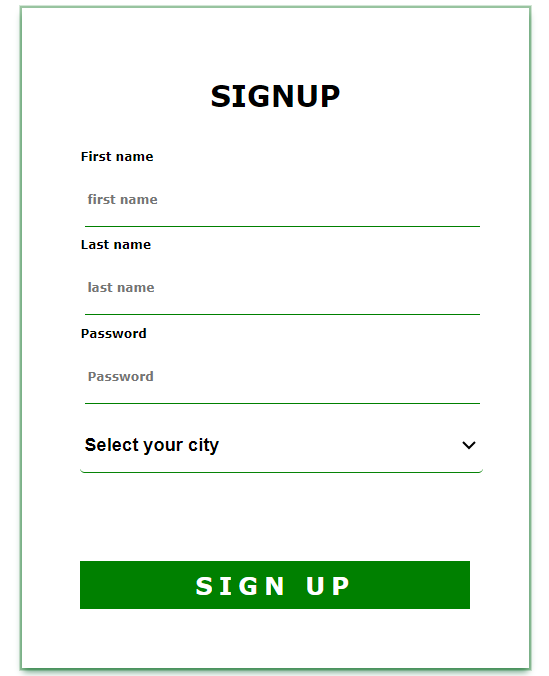
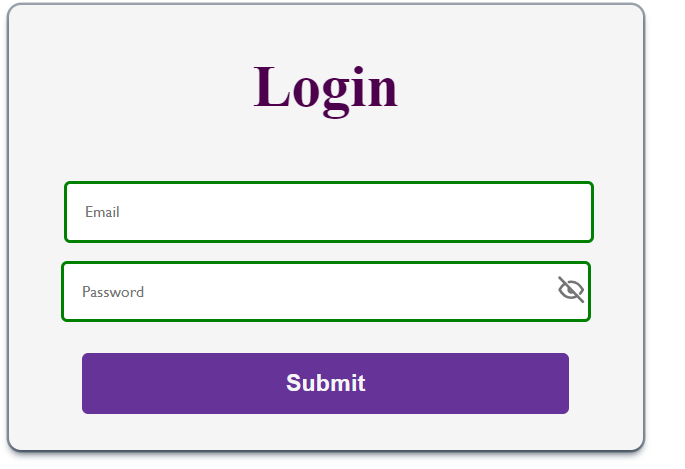
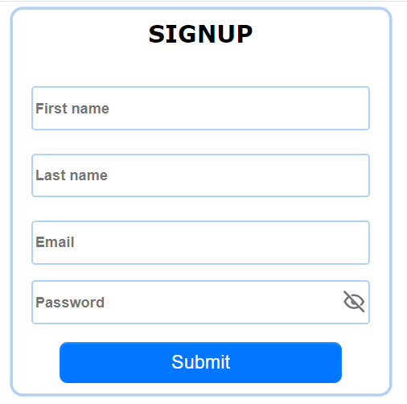
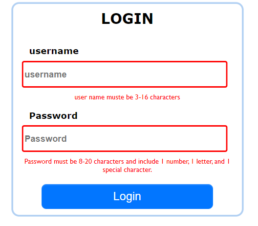
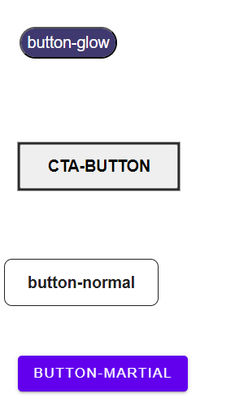

---
---

**Ce projet est une bibliothèque de formulaires réutilisables pour les applications web.**

---

- Variété de boutons, d'entrées et de formulaires préconçus.
- Personnalisable en termes de style, de couleur et de comportement.
- Thèmes prédéfinis disponibles pour une harmonisation rapide.
- Solution complète et flexible pour les nouveaux projets ou les mises à jour d'applications existantes.
- Facilite l'intégration et améliore l'expérience utilisateur.

## Installation

**Pour commencer à utiliser la bibliothèque, suivez ces étapes :**

      npm i @shark-man/react-form

---

### les listes des classes et des props

---

| Nom de la Classe | Description                                       |
| ---------------- | ------------------------------------------------- |
| basic-form       | Classe pour un formulaire standard                |
| vectorForm       | Classe pour un formulaire avec un thème vectoriel |
| animal-form      | Classe pour un formulaire avec un thème animalier |
| formWild         | Classe pour un formulaire avec un thème wild      |

### Props pour les champs Input :

| Props        | Description                                                         | Exemple                                                                                                    |
| ------------ | ------------------------------------------------------------------- | ---------------------------------------------------------------------------------------------------------- |
| type         | Type de champ (par exemple, "text", "password", etc.)               | `type="password"`                                                                                          |
| name         | Nom du champ dans le formulaire                                     | `name="password"`                                                                                          |
| placeholder  | Texte à afficher en tant que placeholder dans le champ              | `placeholder="Password"`                                                                                   |
| label        | Étiquette du champ                                                  | `label="Password"`                                                                                         |
| pattern      | Modèle de validation du champ(vous pouvez aussi ajouter les votres) | `pattern="(?=.*[0-9])(?=.*[a-zA-Z])(?=.*[!@#$%^&*])[a-zA-Z0-9!@#$%^&*]{8,20}"`                             |
| errorMessage | Message d'erreur affiché en cas de validation échouée               | `errorMessage="Password must be 8-20 characters and include 1 number, 1 letter, and 1 special character."` |

#### Ce code présente un formulaire de collecte d'informations dans une application React en utilisant des composants de la bibliothèque "@shark-man/react-form".

---

```jsx
import { Input, Form } from "@shark-man/react-form";
function App() {
  return (
    <Form className="vectorForm">
      <h2> Signup </h2>
      <Input
        type="text"
        name="first name"
        placeholder="first name"
        label="First name"
        pattern="^[A-Za-z0-9]{3,16}$"
        required="true"
        errorMessage="first name must be 3-16 characters"
      />
      <Input
        type="text"
        name="last name"
        placeholder="last name"
        label="Last name"
        pattern="^[A-Za-z0-9]{3,16}$"
        required="true"
        errorMessage="last name must be 3-16 characters"
      />
      <Input
        type="password"
        name="password"
        placeholder="Password"
        label="Password"
        required="true"
        pattern="(?=.*[0-9])(?=.*[a-zA-Z])(?=.*[!@#$%^&*])[a-zA-Z0-9!@#$%^&*]{8,20}"
        errorMessage="Password must be 8-20 characters and include 1 number, 1 letter, and 1 special character."
      />

      <select>
        <option value="test">Select your city</option>
        <option value="test">Lyon</option>
        <option value="test">Paris</option>
      </select>
      <button> Sign up </button>
    </Form>
  );
}

export default App;
```

### Voici le rendu!

---



#### Ce code crée un formulaire de connexion dans une application React en utilisant des composants de la bibliothèque "@shark-man/react-form".
---
---


```jsx
import { Form, Input, InputPassword } from "@shark-man/react-form";
import { useState } from "react";

function App() {
  const [data, setData] = useState({
    email: "",
    password: "",
  });

  const handleSubmit = () => {
    console.log(data);
  };

  const handleChange = (event) => {
    const { name, value } = event.target;
    setData({
      ...data,
      [name]: value,
    });
  };

  return (
    <Form onSubmit={(e) => e.preventDefault()} className="formWild">
      <h2>Login</h2>
      <Input
        type="email"
        name="email"
        onChange={handleChange}
        value={data.email}
        placeholder="Email"
      />
      <InputPassword
        name="password"
        onChange={handleChange}
        value={data.password}
        placeholder="Password"
      />
      <button type="button" onClick={handleSubmit}>
        {" "}
        Submit{" "}
      </button>
    </Form>
  );
}

export default App;

```

### Voici le rendu!




#### Ce code montre comment créer un formulaire d'inscription dans une application React en utilisant des composants de la bibliothèque _"@shark-man/react-form"_.
---
---


```jsx
import { Form, Input, InputPassword } from "@shark-man/react-form";
import { useState } from "react";

function App() {
  const [data, setData] = useState({
    firstname: "",
    lastname: "",
    email: "",
    password: "",
  });
  const handleSubmit = () => {
    console.log(data);
  };
  const handleChange = (event) => {
    const { name, value } = event.target;
    setData({
      ...data,
      [name]: value,
    });
  };
  return (
    <>
      <Form onSubmit={(e) => e.preventDefault()} className="basic-form">
        <h2>Signup</h2>
        <Input
          type="text"
          name="firstname"
          onChange={handleChange}
          value={data.firstname}
          placeholder="First name"
          required="true"
          errorMessage=" you must fill in "
        />
        <Input
          type="text"
          name="lastname"
          onChange={handleChange}
          value={data.lastname}
          placeholder="Last name"
          required="true"
          errorMessage=" you must fill in "
        />
        <Input
          type="email"
          name="email"
          onChange={handleChange}
          value={data.email}
          placeholder="Email"
          required="true"
          errorMessage="you must enter a valid email"
        />
        <InputPassword
          name="password"
          onChange={handleChange}
          value={data.password}
          placeholder="Password"
          required="true"
        />
        <button type="button" onClick={handleSubmit}>
          {" "}
          Submit{" "}
        </button>
      </Form>
    </>
  );
}

export default App;

```

### Voici le rendu!




#### Ce code représente un formulaire de connexion React qui utilise les composants Input et Form du package "@shark-man/react-form", avec validation des données pour les champs de nom d'utilisateur et de mot de passe.
---
---


```jsx
import { Input, Form } from "@shark-man/react-form";

function App() {
  return (
    <Form className="basic-form">
      <h2> Login </h2>
      <Input
        type="text"
        name="username"
        placeholder="username"
        label="username"
        pattern="^[A-Za-z0-9]{3,16}$"
        errorMessage="user name muste be 3-16 characters"
        required="true"
      />
      <Input
        type="password"
        name="password"
        placeholder="Password"
        label="Password"
        pattern="(?=.*[0-9])(?=.*[a-zA-Z])(?=.*[!@#$%^&*])[a-zA-Z0-9!@#$%^&*]{8,20}"
        errorMessage="Password must be 8-20 characters and include 1 number, 1 letter, and 1 special character."
        required="true"
      />
      <button> Login</button>
    </Form>
  );
}

export default App;

```

### Voici le rendu!




## Ce code importe et utilise un composant Button de la bibliothèque _"@shark-man/react-form"_. Il démontre comment créer plusieurs boutons avec différents styles en utilisant des classes CSS spécifiques.
---


```jsx
import { Button } from "@shark-man/react-form";

function App() {
  return (
    <div>
       <br />
      <Button className="button-glow">button-glow</Button>
     
      <Button className="cta-button"> cta-button</Button>
      <br />
     
      <Button className="button-normal">button-normal</Button>
      <br />
     
      <Button className="button-martial">button-martial</Button>
    </div>
  );
}

export default App;
```

### Voici le rendu!


